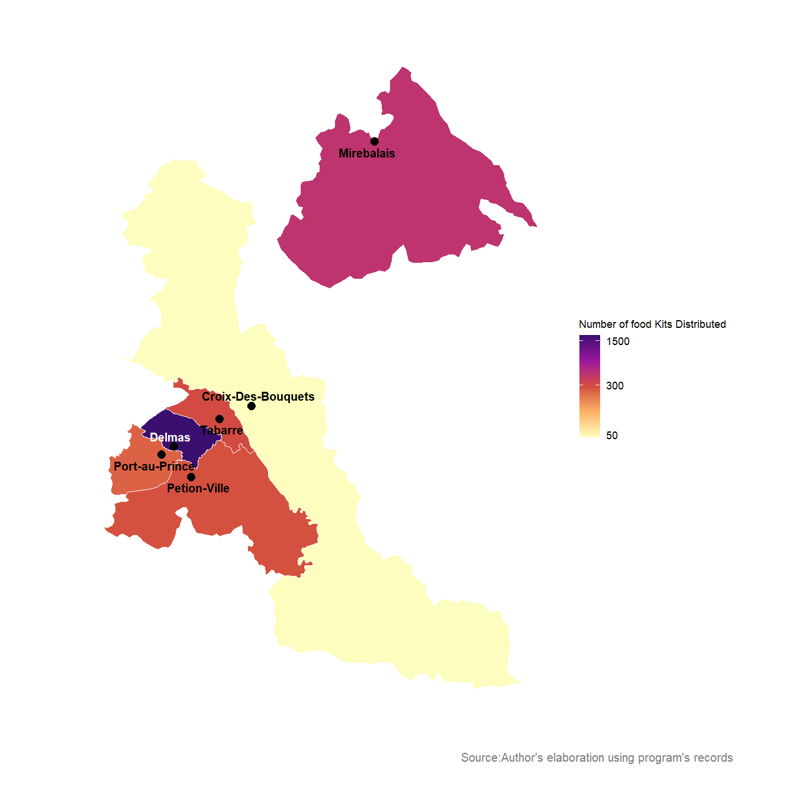

# Learningbrief_fooddistribution_haiti
 Choropleth map use for the learning brief [Empowering Communities: Emergency Food Distributions for Displaced Communities in Port-au-Prince, Haiti](https://reliefweb.int/report/haiti/empowering-communities-emergency-food-distributions-displaced-communities-port-au-prince-haiti-october-2024) using `Tidyverse` 

**Choropleth map of Distribution of food kits across communes in the Metropolitan Area of Port-au-Prince, Haiti**

